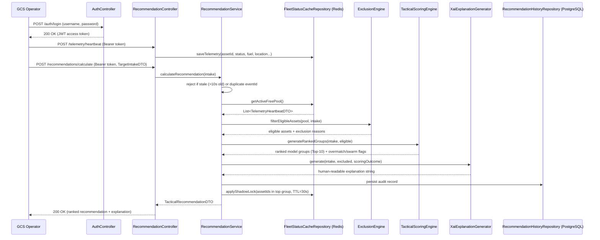

# System Architecture

## Project Name
Ro (Tactical Decision Support & Triage Engine)

## Core Philosophy
This system is **NOT** a Command & Control (C2) or flight control system. It is a stateless, reactive microservice that calculates and returns Top-10 hierarchical tactical recommendation payloads for Ground Control Station (GCS) operators. It never issues a command to any asset — it only produces a ranked, explained recommendation. The human operator always makes the final call.

## Package Hierarchy
- `domain` — DTOs, Models, Enums
- `repository` — JPA (audit history) & Redis (live fleet cache)
- `engine` — Exclusion, Scoring, Geo, XAI Explanation
- `security` — JWT issuance/validation and the Spring Security filter chain
- `controller` — REST Gateway
- `service` — Orchestrates the end-to-end pipeline

## Authentication

Every `/api/v1/**` endpoint except `/api/v1/auth/login` requires a JWT
Bearer token, enforced by a stateless Spring Security filter chain
(`security/SecurityConfig`). A `JwtAuthenticationFilter` validates the
token and populates the security context before the request reaches
`RecommendationController`; missing/invalid tokens are rejected with a
`ProblemDetail` 401 (`security/RestAuthenticationEntryPoint`), consistent
with the error format used elsewhere in this API.

There is no user-management subsystem — a single GCS-operator account is
seeded from `OPERATOR_USERNAME`/`OPERATOR_PASSWORD` (`security/SecurityConfig`),
and tokens are signed with `JWT_SECRET` (`security/JwtService`). This is
sufficient to gate a capstone demo service; it is not a production identity
provider.

## Request Flow

## Pipeline Stages Explained

The core of the project is `RecommendationService#calculateRecommendation`, which
runs every incoming target through five deterministic stages:

**1. Validity gate.** Two guard checks run before any scoring happens:
   - *Stale-data rejection* — if the intake payload's timestamp is more than 10
     seconds old, it's rejected outright (`StaleDataException`). This models the
     reality that tactical data ages out fast and must never be acted on late.
   - *Idempotency* — each event carries an `eventId`; Redis (`SETNX` with a 10s
     TTL) guarantees the same event is never processed twice
     (`DuplicateEventException`).

**2. Exclusion (`ExclusionEngine`).** Every asset in the live fleet pool is
   checked against hard disqualifiers, in order:
   - Status `MAINTENANCE_REQUIRED` or `MANUAL_OVERRIDE` → excluded.
   - Zero munitions remaining → excluded.
   - Insufficient fuel for a round trip to the target plus a 15% safety
     margin (`bingoFuelThresholdPercent`, using haversine distance via
     `GeoUtils`) → excluded.

   Assets that pass all four checks move to scoring; everything else is
   recorded with a machine-readable reason code (surfaced later in the XAI
   explanation).

**3. Scoring (`TacticalScoringEngine`).** Each eligible asset gets a numeric
   score built from its currently loaded munition and the target context:
   - Base score = munition power × 10.
   - **Overmatch bonus** if munition power strictly exceeds the target's
     threat level.
   - **Weather adjustment** — dense fog penalizes laser-guided munitions
     (can't maintain a lock through fog) and rewards GPS/INS-guided ones.
   - **Movement adjustment** — a moving target favors laser-guided munitions
     (can re-track in flight); a stationary target favors GPS/INS (commits to
     a fixed coordinate at launch, which is fine if the target isn't moving).
   - **EW penalty** — an active jammer polygon forces a detour waypoint,
     applied uniformly to every asset.

   Assets are then grouped by model, and within each model group further
   clustered by location + status. A **Swarm Allocation** rule pairs up two
   medium-tier assets when no single asset alone achieves overmatch — i.e.
   the engine can recommend "send two" instead of "send one" when that's the
   only way to guarantee sufficient effect.

**4. Deterministic tie-breaking.** Any score tie is resolved, in strict
   order, by: (1) higher fuel percentage, (2) alphanumeric `assetId`. This
   guarantees the same inputs always produce the same output — a
   reproducibility requirement for an auditable recommendation system.

**5. Explanation (`XaiExplanationGenerator`) + audit trail.** A natural
   -language explanation is generated describing *why* the top group was
   chosen (weather, movement, EW, overmatch vs. swarm, tie-break) and *why*
   other assets were excluded. The full recommendation — including the
   ranked payload as JSON — is persisted to PostgreSQL for auditability, and
   the top-ranked assets receive a 30-second **Shadow Lock** in Redis so two
   concurrent requests can't be recommended the same asset.

## Batch Intake

`POST /recommendations/calculate/batch` accepts multiple `TargetIntakeDTO`s
in one call and runs each through the exact same five-stage pipeline, in
request order. Because each intake's Shadow Lock write lands in Redis
before the next intake's pool read, a later target in the same batch
correctly sees earlier targets' top-ranked assets as unavailable — the same
invariant that protects two concurrent single-item requests also protects
one multi-target batch. There is no partial-success handling: the first
rejected intake (stale/duplicate) aborts the whole batch, and any audit
records already persisted for earlier intakes in that batch are not rolled
back.

## Audit Query

`RecommendationHistoryRepository` (write-only until now) is exposed
read-only via `RecommendationHistoryQueryService` and
`RecommendationHistoryController`:
- `GET /recommendations/history/{recommendationId}` — a single past
  recommendation, 404 (`RecommendationNotFoundException`) if unknown.
- `GET /recommendations/history?targetId=&page=&size=` — paginated,
  newest-first by default, optionally filtered to one target.

This turns the audit trail from a write-only compliance artifact into
something an operator or analyst can actually query. `target_id` and
`created_at` are indexed (`RecommendationHistoryEntity`'s `@Table(indexes = ...)`)
since both query paths above filter or sort on them — without an index,
either would degrade to a full table scan as the audit trail grows.

## Example Scenario

A `TargetIntakeDTO` arrives for a moving target with threat level 6, under
active EW jamming. Three eligible assets survive exclusion:

| Asset | Munition | Power | Base | Overmatch | Moving+Laser | EW | Total |
|-------|----------|-------|------|-----------|--------------|-----|-------|
| A-101 | BOZOK    | 6     | 60   | +0 (6=6, not >6) | +25 | -5 | 80 |
| A-102 | TOLUN    | 8     | 80   | +50       | -20          | -5  | 105 |
| A-103 | MAM_C    | 5     | 50   | +0        | +25          | -5  | 70 |

`A-102` (TOLUN) ranks highest — its GPS/INS guidance takes a penalty for the
moving target, but its raw overmatch bonus (power 8 > threat 6) dominates.
The engine returns it as the top recommendation, applies a 30s shadow lock
to it, and the XAI explanation states the EW reroute, the movement-guidance
trade-off, and the overmatch justification in plain language. The same five
numbers in the table's A-102 row are what `topAssetScoreBreakdown` returns
as structured JSON on `TacticalRecommendationDTO` — the machine-readable
counterpart to the natural-language explanation, for callers that want to
consume the "why" without parsing a sentence. Note that only `DENSE_FOG`
currently has a weather effect; `HEAVY_RAIN` and `STORM` are accepted values
but don't yet adjust scoring.

## Test Coverage

| Test class | What it verifies |
|------------|-------------------|
| `ExclusionEngineTest` | Each exclusion reason (maintenance, manual override, zero munitions, bingo fuel) fires independently and correctly |
| `TacticalScoringEngineTest` | Swarm Allocation paired-overmatch edge case; every `MunitionType` × `WeatherCondition` × `TargetMovementStatus` combination produces the documented score breakdown; EW penalty on/off |
| `RecommendationServiceTest` | End-to-end orchestration: stale/duplicate rejection, pipeline wiring, audit persistence, shadow-lock application, batch delegation and fail-fast on the first rejected intake |
| `RecommendationControllerTest` | HTTP layer — request validation, status codes, error mapping, batch endpoint |
| `RecommendationHistoryQueryServiceTest` | Audit lookups by recommendationId (found/not-found) and by targetId, pagination pass-through |
| `RecommendationHistoryControllerTest` | Audit HTTP layer — 200/404 on single lookup, filtered/unfiltered paginated listing |
| `AuthControllerTest` | Login endpoint — token issuance on valid credentials, 401 on invalid credentials |
| `JwtSecurityIntegrationTest` | The real Spring Security filter chain — requests without/with an invalid/with a valid Bearer token |
| `TargetIntakeDTOValidationTest` | Bean Validation constraints on inbound target intake payloads |
| `TelemetryHeartbeatDTOValidationTest` | Bean Validation constraints on inbound telemetry payloads |
| `JsonNodeConverterTest` | JPA attribute converter that persists the ranked payload as JSONB |
| `RoApplicationTests` | Spring context loads successfully |

## Absolute Rules

a) Stale data with timestamps older than 10 seconds must be rejected immediately.
b) Redis must enforce a 30-second Time-To-Live (TTL) Shadow Lock on recommended assets.
c) Assets with `MAINTENANCE_REQUIRED` or `MANUAL_OVERRIDE` status must be strictly excluded from all scoring calculations.
d) Tie-breaking conditions in scoring must be 100% deterministic.
